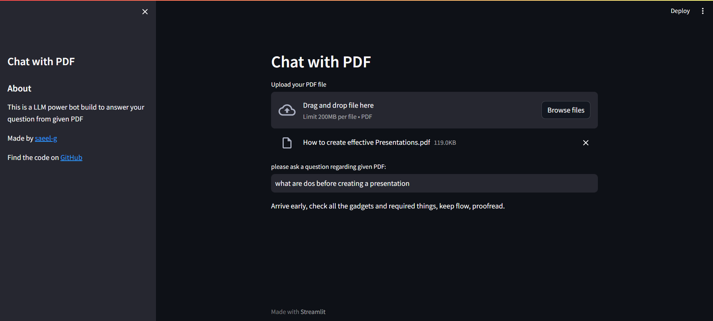

# ChatPDf Bot
A chat bot made to answer questions from your PDFs.

## Overview
The Chat PDF App is a simple web application that allows users to upload PDF files and interact with a chatbot to ask questions and receive answers based on the content of the uploaded PDF.

## Screenshot


## Features
* **PDF Upload:** Users can upload their PDF files directly to the application.
* **Chatbot Interface:** Users can ask questions in a chat interface, and the chatbot will provide answers based on the content of the uploaded PDF.
* **Machine Learning Model:** The chatbot is powered by a machine learning model that processes and analyzes the PDF content.
* **GitHub Repository:** The source code for this project is available on GitHub here.
* **Screencast Tutorial:** You can watch a detailed explanation of the codebase in a screencast here.
* **Cloud Deployment:** The application is deployed in a cloud environment, and you can access it here.
## Working
Watch this [Video](https://drive.google.com/file/d/1rRhhAdWNvFYexT7-Mw_S9HAwHuwfQTH4/view?usp=sharing)


## Getting Started

To run this application locally, follow these steps:

1. Clone the GitHub repository:
```bash
git clone https://github.com/saeel-g/ChatPDF.git
```
2. Install the required dependencies:
```bash
pip install -r requirements.txt
```
3. create a ".env" file in the same project folder and inside it write:
```bash
OPENAI_API_KEY= Insert your key here
```
4. Insert following command in terminal
```bash
streamlit run main.py
```
5. Open your web browser and navigate to given local host url to use the app.

# Usage
1. Upload a PDF file using the "Upload PDF" button.
2. Ask questions in the chat interface.
3. The chatbot will analyze the PDF content and provide answers.

# Support
If you encounter any issues or have questions, please create a GitHub issue

# Contact
For any inquiries, you can contact us at saeelg30@gmail.com.
